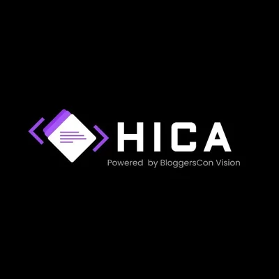

# HICA PRMITR

  
  
  

## 🎯 Our Mission

At HICA PRMITR, we are committed to creating a vibrant technical community that fosters innovation, collaboration, and continuous learning. We aim to bridge the gap between academic knowledge and industry requirements by providing hands-on experience and exposure to cutting-edge technologies.

## 🌟 Our Vision

To be the premier technical community at PRMITR that:
- Cultivates a culture of innovation and problem-solving
- Prepares students for real-world technical challenges
- Creates a platform for knowledge sharing and networking
- Develops future-ready tech professionals

## 🚀 What We Do

### Technical Excellence
- Organize workshops and hands-on sessions
- Conduct hackathons and coding competitions
- Host expert talks and industry interactions
- Provide mentorship and guidance

### Community Building
- Create a collaborative learning environment
- Foster peer-to-peer knowledge sharing
- Build a strong network of tech enthusiasts
- Encourage teamwork and leadership

### Skill Development
- Focus on practical implementation
- Stay updated with latest technologies
- Develop problem-solving abilities
- Enhance communication and presentation skills

## 🎯 Our Goals

1. **Technical Growth**
   - Master emerging technologies
   - Develop industry-relevant skills
   - Build innovative projects
   - Participate in national/international competitions

2. **Community Impact**
   - Create a positive learning environment
   - Share knowledge with fellow students
   - Collaborate on meaningful projects
   - Build a strong alumni network

3. **Industry Connect**
   - Bridge the gap between academia and industry
   - Provide industry exposure
   - Facilitate internship opportunities
   - Prepare students for technical careers

## 🤝 Join Us

We welcome all tech enthusiasts who are passionate about learning and growing together. Whether you're a beginner or an expert, there's a place for you in our community.

## 📞 Connect With Us

- Email: [hica.prmitr@gmail.com](mailto:hica.prmitr@gmail.com)
- Website: [https://hica-prmitr.github.io/Hica-Prmitr-Web1/](https://hica-prmitr.github.io/Hica-Prmitr-Web1/)

---

  Building the future, one innovation at a time 🚀

